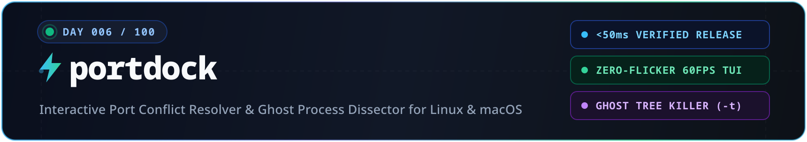
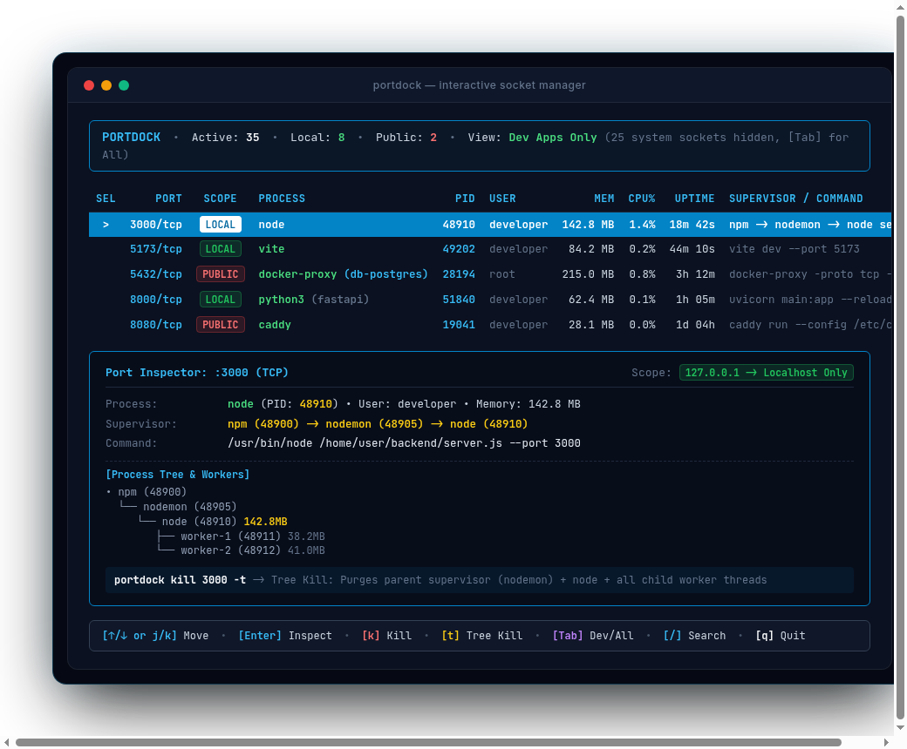
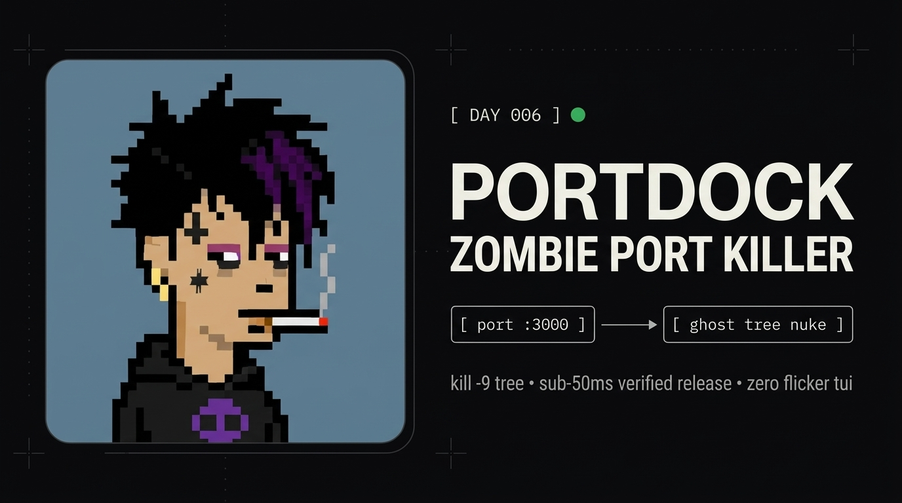

<div align="center">



<p align="center">
  <a href="#quickstart"><b>Quickstart</b></a> &nbsp;•&nbsp;
  <a href="#command-cheat-sheet"><b>Command Cheat Sheet</b></a> &nbsp;•&nbsp;
  <a href="#interactive-tui-controls"><b>TUI Controls</b></a> &nbsp;•&nbsp;
  <a href="#under-the-hood-technical-architecture"><b>Architecture</b></a>
</p>



</div>

## Quickstart

```bash
# 1-second automated install
curl -fsSL https://raw.githubusercontent.com/aotlover9-base-eth/portdock/main/install.sh | bash

# Launch zero-flicker interactive dashboard
portdock

# Standard kill (frees port in <50ms)
portdock kill 3000

# Ghost tree kill (purges parent supervisor + all worker processes)
portdock kill 3000 -t

# Deep inspect port & process hierarchy
portdock 3000
```

---

## Command Cheat Sheet

| Command | Action |
|:---|:---|
| `portdock` | Launch interactive zero-flicker TUI dashboard |
| `portdock 3000` | Deep inspect port 3000 (PID, RSS memory, uptime, supervisor tree) |
| `portdock kill 3000` | Sub-50ms graceful kill with verified socket release |
| `portdock kill 3000 -t` | Ghost tree kill (terminates parent supervisor + worker tree) |
| `portdock kill 3000 8080 5432` | Batch kill multiple ports in one command |
| `portdock kill 3000 -f` | Immediate force kill (`SIGKILL`) |
| `portdock list --apps` | List active dev & user applications (hides OS daemons) |
| `portdock list --public` | List ports exposed to all interfaces (`0.0.0.0` / `::`) |
| `portdock list --json` | Export structured JSON for CI/CD pipelines |
| `portdock wait 3000 --timeout 15` | Block until port 3000 is released |
| `portdock wait 3000 --open` | Block until server on port 3000 is ready |

---

## Interactive TUI Controls

| Key | Action |
|:---:|:---|
| `↑ / ↓` or `j / k` | Move selection (atomic zero-flicker frame redraw) |
| `[Tab]` | Toggle **Dev Apps Only** vs **All Ports** (including OS daemons) |
| `[Enter]` or `d` | Deep Port Inspector card with live process tree |
| `k` | Kill with visual `[Enter]` confirmation prompt |
| `t` | Ghost Tree Kill with confirmation prompt |
| `/` or `f` | Live interactive search & filter |
| `r` | Refresh ports list |
| `q` or `Esc` | Quit / Back |

---

## Installation

### 1-Line Installer
```bash
curl -fsSL https://raw.githubusercontent.com/aotlover9-base-eth/portdock/main/install.sh | bash
```

### Via Pip / Pipx
```bash
pip install git+https://github.com/aotlover9-base-eth/portdock.git
```

### From Source
```bash
git clone https://github.com/aotlover9-base-eth/portdock.git
cd portdock && ./install.sh
```

---

## Under The Hood (Technical Architecture)

### 1. The Ghost Resurrect Problem (`-t / --tree`)
When killing a dev server like Next.js, Vite, or Django, tools like `kill-port 3000` only target the leaf process listening on the socket. The parent supervisor (`npm`, `nodemon`, `cargo-watch`, `pm2`) detects child termination and immediately forks a replacement process on the same port, causing continuous `EADDRINUSE` failures.

`portdock` crawls `/proc` backwards up the process hierarchy (`PPID` traversal) to find the top supervisor and sends a grouped termination sequence across the supervisor and all child workers simultaneously.

```text
[npm run dev] (PID: 48900)  <-- portdock -t identifies & kills root supervisor
      │
   [nodemon]   (PID: 48905)
      │
    [node]     (PID: 48910)  <-- leaf listener on :3000
   ├── [worker-1] (PID: 48911)
   └── [worker-2] (PID: 48912)
```

### 2. Verified Socket Release Loop
Most CLI kill utilities send `SIGTERM` and return immediately. The kernel socket often lingers in `TIME_WAIT` or the process takes 50-150ms to flush memory, causing the next startup command to fail immediately.

`portdock` executes:
`SIGTERM` -> 200ms grace window -> `SIGKILL` escalation -> Kernel bind probe (`is_port_free`) -> Verified zero-bound sockets before exiting.

### 3. Zero-Flicker 60fps TUI Engine
Traditional terminal scripts invoke `clear` (`\x1b[2J\x1b[H`) on each keypress, clearing the screen to black before printing lines, which causes severe flickering when scrolling.

`portdock` uses:
- Alternate screen buffer (`\x1b[?1049h\x1b[?25l`)
- Off-screen buffer capture
- Cursor-home atomic overwrite (`\x1b[H` + `buffer` + `\x1b[J`)
- Windowed viewport calculation (`shutil.get_terminal_size()`) to prevent terminal scrollback bouncing

### 4. Docker Container Resolution
When Docker exposes ports (`-p 3000:3000`), the host socket is held by `docker-proxy`. `portdock` detects `docker-proxy` instances, queries container state, and displays the underlying container name and image directly in the table.

### 5. Self & System Protection Boundary
To prevent catastrophic accidental kills, `portdock` enforces guard boundaries:
- **PID Protection**: Never terminates `portdock` itself or its parent shell.
- **Terminal & IDE Protection**: Shields active IDE instances (VS Code, Cursor, Antigravity) and test runners (pytest).
- **System Daemon Isolation**: 30+ root OS sockets (`systemd-resolved`, `cupsd`, `avahi-daemon`) are categorized and tucked under the `[Tab]` toggle.

---

<div align="center">
  
</div>

---

## License

MIT License. Built for developer productivity.
